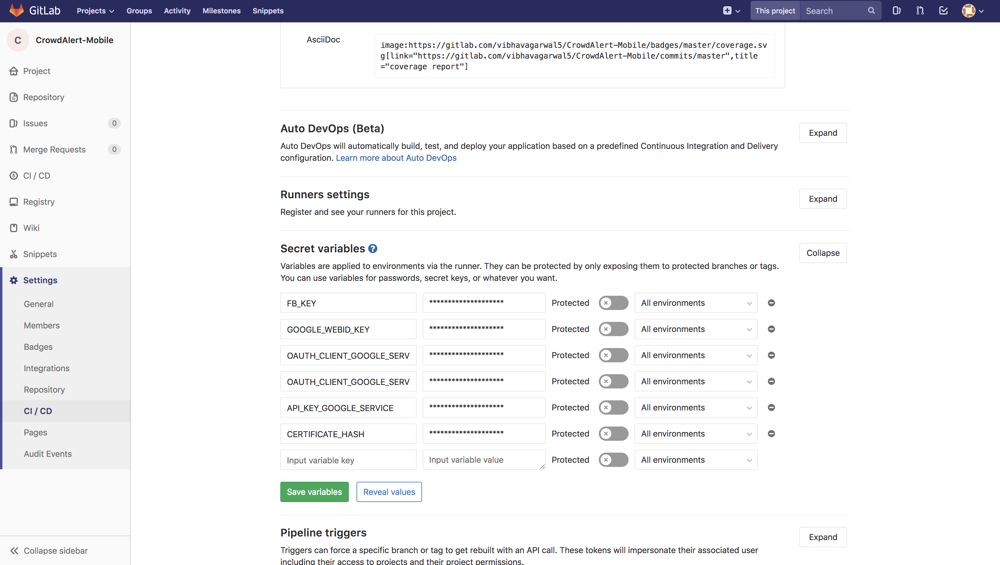

# CrowdAlert

A crowdsourced hybrid mobile application using React Native for reporting and viewing incidents around the globe.

## Install basic Dependencies

This project is built using React Native. You will need the following dependencies.

### Node and Watchman

Install Node and Watchman using Homebrew.

```
brew install node
brew install watchman
```

### React Native CLI

Install React Native CLI globally.

```
npm install -g react-native-cli
```

### NPM Dependencies

Install package-dependencies using NPM

```
npm install
```

## Setting up the keys

### On your local machine

Create a `.env` file add your keys like following:

```
FB_KEY=
GOOGLE_WEBID_KEY=
OAUTH_CLIENT_GOOGLE_SERVICE_KEY1=
OAUTH_CLIENT_GOOGLE_SERVICE_KEY3=
API_KEY_GOOGLE_SERVICE=
CERTIFICATE_HASH=
```

After adding this `.env` file run:

```
npm install -g envsub
bash createKeys.sh
```

This will sync your keys with the project.

You will find these keys in the following files,
*   `android/app/src/main/res/values/strings.xml`
*   `src/components/login.js`
*   `android/app/google-services.json.template`

#### **_Note1:_**
Make sure that when you download your  `google-services.json` file, you rename it to `google-services.json.template` with the proper env tags. Check the current `android/app/google-services.json.template` for more help.

#### **_Note2:_**
Ensure that before you run `react-native run-android` or `react-native run-ios` or `any other build command`, you should setup your environment keys using the above method, otherwise your build won't work.

### On your Forked repository for CI pipeline

Add the above keys with the same name in the secret variables section in the **Settings -> CI/CD -> Secret Variables** section of your forked repository. <br>
Example:


## Install Other Dependencies

### Android (Android Studio)

#### Update your Android SDK location

Add android/local.properties file

```
sdk.dir = <your android sdk location>
```

#### Running the App

```
react-native run-android
```

### iOS (Xcode)

#### Xcode

Make sure you have Xcode 8 or higher and the correct command line tool is specified

#### Pods Dependencies

Install pods using cocoa-pods

```
cd ios
pod install
```

#### Running the App

```
cd <project-dir>
react-native run-ios
```

You can also run it directly from within Xcode or Nuclide.
