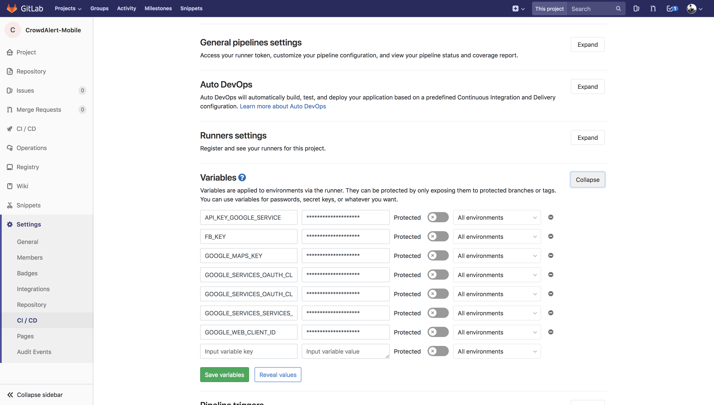

## Setting up the keys

### On your local machine

Create a `.env` file in the root folder of the project and add your keys like the following:

```
FB_KEY=
GOOGLE_MAPS_KEY=
GOOGLE_WEB_CLIENT_ID=

IOS_GOOGLE_CLIENT_ID=
REVERSE_CLIENT_ID=
FB_CUSTOM_URL_SCHEME=

GOOGLE_SERVICES_OAUTH_CLIENT_TYPE11=
GOOGLE_SERVICES_OAUTH_CLIENT_TYPE11_CERTIFICATE_HASH=
GOOGLE_SERVICES_OAUTH_CLIENT_TYPE12=
GOOGLE_SERVICES_OAUTH_CLIENT_TYPE12_CERTIFICATE_HASH=
GOOGLE_SERVICES_OAUTH_CLIENT_TYPE13=
GOOGLE_SERVICES_OAUTH_CLIENT_TYPE13_CERTIFICATE_HASH=
API_KEY_GOOGLE_SERVICE=
GOOGLE_SERVICES_SERVICES_CLIENT_TYPE2=
```

After adding this `.env` file run:

```
$ npm install -g envsub
$ bash createKeys.sh
```

This will sync your keys with the project.

You will find these keys in the following files,

*   `android/app/src/main/res/values/strings.xml`
*   `src/components/homeLogin.js`
*   `android/app/google-services.json.template` >> `android/app/google-services.json`

### **_Note:_**

*   Make sure that when you download your `google-services.json` file, you rename it to `google-services.json.template` with the proper env tags. Check the current `android/app/google-services.json.template` for more help.

*   Whenever you are starting on this for the first time ensure that when u download your `google-services.json` file, its in the same format with the `google-services.json.template` file. Otherwise change the `.template` file according to the lastest file.

*   Ensure that before you run `react-native run-android` or `react-native run-ios` or `any other build command`, you should setup your environment keys using the above method, otherwise your build won't work.

### On your Forked repository for CI pipeline

Add the above keys with the same name in the secret variables section in the **Settings -> CI/CD -> Variables** section of your forked repository. <br>
Example:

