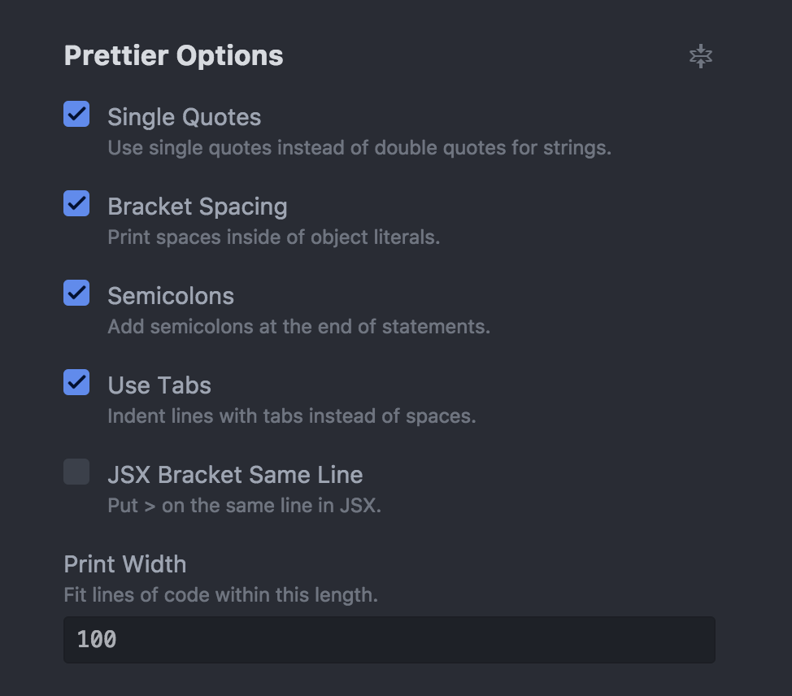

# Contribution Guide

1.  All the major code should be inside the `src` folder in the _root folder_.

2.  All folder names should start with _small letters_ to maintain code uniformity.

3.  All file names also should be in _small letters_. Whereas the **Class** inside those files should start with _capital letter_.

4.  All styling that you do for the components should **NOT** be _inline_ but a separate _Stylesheet_ file should be created inside `./src/assets/styles`.

5.  The code you write should be well documented and must follow the rule of 100 characters per line. You can set this limit from your editors settings.

6.  Use [Prettier](https://prettier.io/) in your editor for auto code formatting and beautification.

7.  Enable `Single Quotes` settings in **Prettier** plugin of your editor. You can change the number of characters per line from the `Print Width` settings option.

### Screenshot of my **Prettier** settings in Atom.

