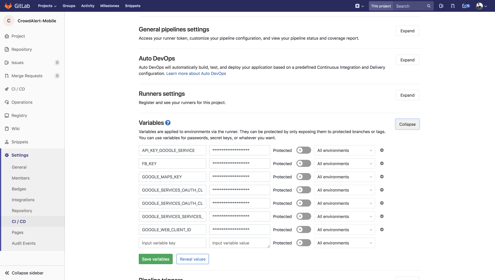

## Setting up the keys

### On your local machine

Download your `google-services.json` or `GoogleService-Info.plist` file from Firebase and add them to `android/app` and `ios` folder respectively.<br>
Create a `.env` file in the root folder of the project and add your keys like the following:

```
FB_KEY=
GOOGLE_MAPS_KEY=
GOOGLE_WEB_CLIENT_ID=

IOS_GOOGLE_CLIENT_ID=
REVERSE_CLIENT_ID=
FB_CUSTOM_URL_SCHEME=
```

This will sync your keys with the project.

You will find these keys in the following files (Incase you want to modify anything related):

*   `android/app/src/main/res/values/strings.xml`
*   `src/components/login/homeLogin.js`
*   `src/components/mapFeed/map/mapScreen.js`
*   `src/actions/emergencyPlacesAction.js`

### **_Note:_**

*   Setup your environment keys as stated above before you run `react-native run-android` or `react-native run-ios` or `any other build command`, otherwise your build will fail.

*   Whenever you are setting up the keys for the first time ensure that when you download your `google-services.json` file and its in the same format with the `google-services.json.template` file. Otherwise change the `.template` file according to the latest file.<br>
    **Contact the maintainer for further help and clarifications regarding this issue.**

### On your Forked repository for CI pipeline

Add the following keys in the secret variables section in the **Settings -> CI/CD -> Variables** of your forked repository to setup the pipeline keys.

```
FB_KEY=
GOOGLE_MAPS_KEY=
GOOGLE_WEB_CLIENT_ID=

IOS_GOOGLE_CLIENT_ID=
REVERSE_CLIENT_ID=
FB_CUSTOM_URL_SCHEME=

DOCKER_SHA1_KEY=
DOCKER_SHA1_KEY_CLIENT_ID=
API_KEY_GOOGLE_SERVICE=
GOOGLE_SERVICES_SERVICES_CLIENT_TYPE2=
```



Rest of it will be handled by the CI itself. Just setup the keys as stated above in the _Secret variables_ section so that the CI can access those.
